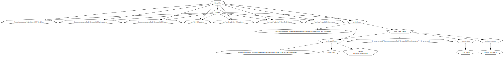

#   BayesNet


[](<https://opensource.org/licenses/MIT>)

[](https://app.codacy.com/gh/Doctorado-ML/BayesNet/dashboard?utm_source=gh&utm_medium=referral&utm_content=&utm_campaign=Badge_grade)
[](https://sonarcloud.io/summary/new_code?id=rmontanana_BayesNet)
[](https://sonarcloud.io/summary/new_code?id=rmontanana_BayesNet)
[](https://deepwiki.com/Doctorado-ML/BayesNet)

[](https://gitea.rmontanana.es/rmontanana/BayesNet)
[](https://doi.org/10.5281/zenodo.14210344)

Bayesian Network Classifiers library

## Using the Library

### Using Conan Package Manager

You can use the library with the [Conan](https://conan.io/) package manager. In your project you need to add the following files:

#### conanfile.txt

```txt
[requires]
bayesnet/1.1.2

[generators]
CMakeDeps
CMakeToolchain
```

#### CMakeLists.txt

Include the following lines in your `CMakeLists.txt` file:

```cmake
find_package(bayesnet REQUIRED)

add_executable(myapp main.cpp)

target_link_libraries(myapp PRIVATE bayesnet::bayesnet)
```

Then install the dependencies and build your project:

```bash
conan install . --output-folder=build --build=missing
cmake -B build -S . -DCMAKE_BUILD_TYPE=Release -DCMAKE_TOOLCHAIN_FILE=build/conan_toolchain.cmake
cmake --build build
```

**Note: In the `sample` folder you can find a sample application that uses the library. You can use it as a reference to create your own application.**

## Building and Testing

The project uses [Conan](https://conan.io/) for dependency management and provides convenient Makefile targets for common tasks.

### Prerequisites

- [Conan](https://conan.io/) package manager (`pip install conan`)
- CMake 3.27+
- C++17 compatible compiler

### Getting the code

```bash
git clone https://github.com/doctorado-ml/bayesnet
cd bayesnet
```

### Build Commands

#### Release Build

```bash
make release        # Configure release build with Conan
make buildr         # Build the release version
```

#### Debug Build & Tests

```bash
make debug          # Configure debug build with Conan
make buildd         # Build the debug version
make test           # Run the tests
```

#### Coverage Analysis

```bash
make coverage       # Run tests with coverage analysis
make viewcoverage   # View coverage report in browser
```

#### Sample Application

Run the sample application with different datasets and models:

```bash
make sample                                    # Run with default settings
make sample fname=tests/data/glass.arff       # Use glass dataset
make sample fname=tests/data/iris.arff model=AODE  # Use specific model
```

### Available Makefile Targets

- `debug` - Configure debug build using Conan
- `release` - Configure release build using Conan  
- `buildd` - Build debug targets
- `buildr` - Build release targets
- `test` - Run all tests (use `opt="-s"` for verbose output)
- `coverage` - Generate test coverage report
- `viewcoverage` - Open coverage report in browser
- `sample` - Build and run sample application
- `conan-create` - Create Conan package
- `conan-upload` - Upload package to Conan remote
- `conan-clean` - Clean Conan cache and build folders
- `clean` - Clean all build artifacts
- `doc` - Generate documentation
- `diagrams` - Generate UML diagrams
- `help` - Show all available targets

## Models

#### - TAN

#### - KDB

#### - SPODE

#### - SPnDE

#### - AODE

#### - A2DE

#### - [BoostAODE](docs/BoostAODE.md)

#### - XBAODE

#### - BoostA2DE

#### - XBA2DE

### With Local Discretization

#### - TANLd

#### - KDBLd

#### - SPODELd

#### - AODELd

## Documentation

### [Manual](https://rmontanana.github.io/bayesnet/)

### [Coverage report](https://rmontanana.github.io/bayesnet/coverage/index.html)

## Diagrams

### UML Class Diagram


### Dependency Diagram


